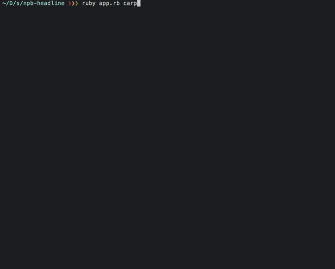

# NPB::Headline

NPB::Headline show the headlines of NPB (Nihon Professional Baseball) based on Y's Sports on command line.

## Usage

To show the headlines, you should just clone and execute ruby:

```
$ git clone git@github.com:kami30k/npb-headline.git
$ cd npb-headline
$ ruby app.rb {team_name}
```

The available values of `team_name` are as follows:

- giants
- swallows
- baystars
- dragons
- tigers
- carp
- lions
- fighters
- marines
- orix
- hawks
- eagles

## Demo



## Contributing

1. Fork it ( https://github.com/kami30k/npb-headline/fork )
2. Create your feature branch (git checkout -b my-new-feature)
3. Commit your changes (git commit -am 'Add some feature')
4. Push to the branch (git push origin my-new-feature)
5. Create a new Pull Request
